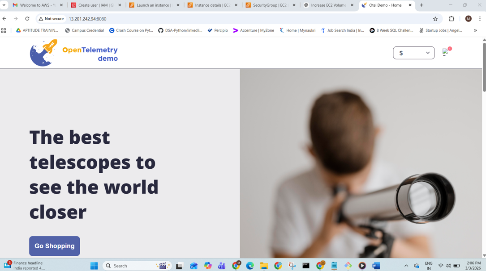
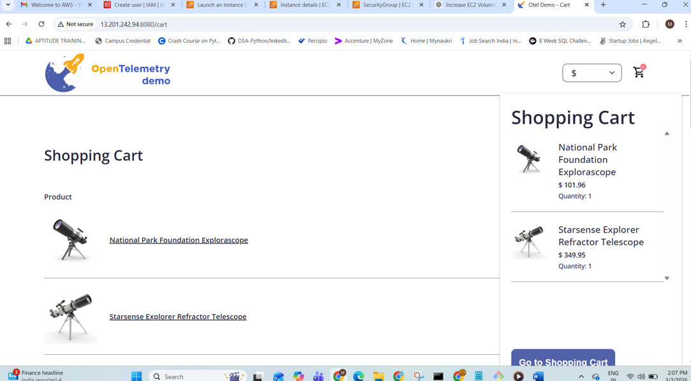

<!-- markdownlint-disable-next-line -->
#  OpenTelemetry Demo

[](https://cloud-native.slack.com/archives/C03B4CWV4DA)
[](https://github.com/open-telemetry/opentelemetry-demo/releases)
[](https://github.com/open-telemetry/opentelemetry-demo/graphs/commit-activity)
[](https://hub.docker.com/r/otel/demo)
[](https://github.com/open-telemetry/opentelemetry-demo/blob/main/LICENSE)
[](https://github.com/open-telemetry/opentelemetry-demo/actions/workflows/run-integration-tests.yml)
[](https://artifacthub.io/packages/helm/opentelemetry-helm/opentelemetry-demo)
[](https://www.bestpractices.dev/en/projects/9247)

## Welcome to the OpenTelemetry Astronomy Shop Demo

This repository contains the OpenTelemetry Astronomy Shop, a microservice-based
distributed system intended to illustrate the implementation of OpenTelemetry in
a near real-world environment.


# 🛒 OpenTelemetry Microservices Demo — DevOps Practice Project

A hands-on DevOps project where I cloned, analyzed, and successfully deployed a **production-grade microservices application** built with **20+ services across 10+ programming languages** using **Docker Compose on an AWS EC2 instance**, and accessed it remotely from my local laptop.

---

## 🎯 Project Objective

To gain practical, real-world experience in:
- Understanding how large-scale microservice architectures are containerized
- Writing and analyzing Dockerfiles across multiple programming languages
- Deploying a full-stack application on a cloud VM (AWS EC2) using Docker Compose
- Networking, port-forwarding, and accessing cloud-hosted apps from a local machine

---

## 🏗️ Architecture Overview

This project is a web-based e-commerce application (Online Boutique / Astronomy Shop) composed of independent microservices communicating via **gRPC** and **HTTP**.

### Services & Technology Stack

| Service | Language / Stack | Purpose |
| :--- | :--- | :--- |
| **ad** | Java (Gradle) | Serves contextual advertisements |
| **cart** | .NET (C#) | Manages user shopping cart (backed by Redis) |
| **checkout** | Go | Orchestrates the checkout & payment workflow |
| **currency** | Node.js / C++ | Converts prices between currencies |
| **email** | Ruby | Sends order confirmation emails |
| **frontend** | Node.js (TypeScript) | Web UI served to the browser |
| **frontend-proxy** | Envoy Proxy | Reverse proxy sitting in front of the frontend |
| **fraud-detection** | Java (Kotlin/Gradle) | Detects fraudulent transactions |
| **payment** | Node.js | Processes credit card payments |
| **product-catalog** | Go | Serves the product listing and details |
| **recommendation** | Python | Suggests products to users |
| **shipping** | Rust | Calculates shipping costs and tracking |
| **quote** | PHP | Provides price quotes |
| **accounting** | .NET (C#) | Handles accounting/bookkeeping logic |
| **load-generator** | Python (Locust) | Simulates user traffic for testing |
| **flagd / flagd-ui** | Go / Node.js | Feature flag management |
| **kafka** | Apache Kafka | Message broker between services |
| **postgres** | PostgreSQL | Relational database |
| **image-provider** | NGINX | Serves static product images |
| **opensearch** | OpenSearch | Search and analytics engine |

---

## 📸 Deployment Screenshots

### 1. Docker Compose Build
Building all microservices on the EC2 instance using `docker compose up --build -d`.


> **Image Path:** `Images/docker compose.png`

### 2. AWS Security Group — Inbound Rule Configuration
Adding a custom TCP inbound rule on port **8080** to allow external access to the application.


> **Image Path:** `Images/Inbound Rule.png`

### 3. Accessing the Application from Local Browser (View 1)
Successfully accessing the deployed application from a local laptop browser at `http://<EC2_PUBLIC_IP>:8080`.



> **Image Path:** `Images/project_access1.png`

### 4. Accessing the Application from Local Browser (View 2)
Another view of the running application accessed remotely via port 8080.



> **Image Path:** `Images/project_access2.png`

---

## 🔑 Key Learnings

### 1. GitHub Actions CI/CD Pipeline (`ci.yaml`)
- Learned how a CI pipeline is structured with **four sequential/parallel jobs**: `build` → `code-quality` → `docker` → `updatek8s`.
- Understood how `needs:` keyword creates job dependencies (e.g., Docker image is only built if unit tests pass).
- Learned how `sed` is used inside CI to automatically update Kubernetes deployment manifests with new image tags — enabling **GitOps-style continuous delivery**.

### 2. `.dockerignore` — Why It Matters
- Learned that `.dockerignore` prevents unnecessary files (like `node_modules/`, `target/`, docs) from being sent to the Docker daemon during builds.
- Understood that different languages generate different local artifacts:
  - **Node.js** → `node_modules/`
  - **Java/Rust** → `target/`
  - **Go** → Dependencies stored globally (nothing to ignore in-project)
- **Key Takeaway:** *"If your local machine generates it automatically when you run/build your code, it belongs in `.dockerignore`."*

### 3. Dockerfile Patterns (Single-Stage vs Multi-Stage)

#### Single-Stage (Simplest)
Used for infrastructure services like **postgres**, **kafka**, **nginx** where no code compilation is needed.
```dockerfile
FROM postgres:17.6
COPY init.sql /docker-entrypoint-initdb.d/
```

#### Multi-Stage for Interpreted Languages (Intermediate)
Used for **Node.js**, **Python**, **Ruby** services. The first stage installs dependencies; the second stage copies only the clean result.
```dockerfile
FROM node:22-alpine AS build
COPY package.json .
RUN npm ci
COPY . .

FROM node:22-alpine
COPY --from=build /app .
CMD ["npm", "start"]
```

#### Multi-Stage for Compiled Languages (Advanced)
Used for **Go**, **Java**, **Rust**, **.NET**. The compiler (often 1GB+) is used in Stage 1 and completely discarded in Stage 2.
```dockerfile
FROM golang:1.22-alpine AS builder
RUN go build -o myapp main.go

FROM alpine
COPY --from=builder /app/myapp .
CMD ["./myapp"]
```
- **Result:** Image size drops from ~1GB to ~15MB!

#### Distroless Images (Expert Security)
Used by **fraud-detection** — the final image has **no shell, no package manager, no basic tools**. Only the JRE and the app binary exist, drastically reducing the attack surface.

### 4. How Application Code Enters a Docker Image
- The `COPY` instruction is how source code gets inside the container.
- **`COPY . .`** = Copies your actual application source code into the image.
- Best practice: Copy dependency files (`package.json`, `go.mod`) first, install dependencies, then copy source code — this maximizes Docker layer caching.

### 5. Build Context Matters
- Services like `ad` reference files outside their own directory (`COPY ./pb ./proto`).
- Therefore, `docker build` must be run **from the repository root**, not from inside `src/ad/`:
  ```bash
  docker build -t my-ad-service -f src/ad/Dockerfile .
  ```

### 6. Identifying Essential vs Non-Essential Files for Deployment
Learned to strip a repository down to only the files needed for deployment:

| Keep ✅ | Remove 🗑️ |
| :--- | :--- |
| `src/`, `pb/`, `internal/` | `kubernetes/`, `test/`, `.github/` |
| `docker-compose.yml`, `.env` files | `CHANGELOG.md`, `CONTRIBUTING.md` |
| `.dockerignore`, `buildkitd.toml` | Linters, bots, IDE configs |

### 7. Deploying on AWS EC2
- Installed Docker on an EC2 instance and ran `docker compose up --build -d`.
- Configured **AWS Security Group Inbound Rules** to open port `8080` (Custom TCP, Source: `0.0.0.0/0`).
- Successfully accessed the running application from my local laptop browser at `http://<EC2_PUBLIC_IP>:8080`.

---

## 🚀 How to Run This Project

### Prerequisites
- An AWS EC2 instance (recommended: `t2.large` or higher with 8GB+ RAM for all services)
- Docker and Docker Compose installed on the instance

### Steps
```bash
# 1. Clone or copy this repository to your EC2 instance
git clone <your-repo-url>
cd ultimate-devops-project-demo_practice

# 2. Build and run all services in detached mode
docker compose up --build -d

# 3. Check all containers are running
docker compose ps

# 4. Access the application
# Open your browser and navigate to:
# http://<YOUR_EC2_PUBLIC_IP>:8080
```

### Stopping the Application
```bash
docker compose down
```

---

## 📂 Project Structure (Minimal Deployment)
```
ultimate-devops-project-demo_practice/
├── src/                          # All microservice source code & Dockerfiles
│   ├── ad/                       # Java ad service
│   ├── cart/                     # .NET cart service
│   ├── checkout/                 # Go checkout service
│   ├── currency/                 # Node.js currency service
│   ├── frontend/                 # Node.js web frontend
│   └── ... (15+ more services)
├── pb/                           # Protobuf API definitions (shared across services)
├── internal/                     # Internal tools
├── docker-compose.yml            # Main orchestrator file
├── docker-compose.minimal.yml    # Lightweight version (fewer services)
├── .env                          # Environment variables
├── .dockerignore                 # Files excluded from Docker builds
├── buildkitd.toml                # Docker BuildKit configuration
└── README.md                     # This file
```

---

## 🧰 Technologies & Tools Practiced

`Docker` · `Docker Compose` · `Multi-Stage Builds` · `GitHub Actions CI/CD` · `AWS EC2` · `Security Groups` · `gRPC / Protobuf` · `Microservices Architecture` · `Go` · `Java` · `Node.js` · `Python` · `Rust` · `.NET` · `Ruby` · `PHP`

---

## 👤 Author

**Krishna Chavan**
DevOps Learner | Practicing containerization, CI/CD, and cloud deployments.


